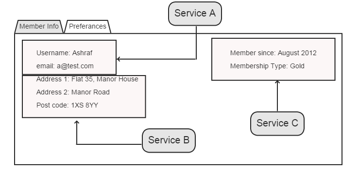

In [part 2](http://www.ashrafmageed.com/Scalability2), I briefly covered Event-Driven SOA and why event messages are preferred for communication between services. I also stated that data should not leak out of a service boundary but didn't answer the question of: how can we ensure services would have the data they need to carry out their tasks when all data is should be local? This is what I will attempt to do in this post.

###Only operate on local data
In order to ensure services are autonomous, they should only operate on local data. That is data they are the technical authority of. This, among other things, eliminates the need for RPC and request/response as well as Temporal and Behavioural coupling (to recap read [part 2](http://www.ashrafmageed.com/Scalability2) of this series). 

###Only Share IDs
As stated in part 2, data should not leak outside the service boundaries and service communicate through events. So what does an event contain? IDs only. This has numerous benefits:

- **No logical coupling:** the event messages are responsible for information from multiple services
- **Easier versioning:** there are no data structures to version or manage, therefore, eliminating the risk of breaking this contract between services.
- **Easier testing:** just as above, there are no data structure or information to test. We only ever just need to test that the event has the correct IDs.
- **No data leaks:** as explained in part 2.

##UI Composition
If service are only allowed to operate on local data and they only share IDs, then how do we ensure that the services have the data they need when they process an event? This is achieved through **UI Composition**.

UI Composition is a technique by which a user interface, or a view, is composed of more than one partial views, each served up by a service in a SOA system. It can be used when either displaying information to the user or capturing information from the user.

UI Composition disseminates the data to the services without creating any coupling among them as they are not aware of each other. This is achieved by encapsulating the knowledge of where to send/get the data to/from as part of the client side code of the partial view. For example, in the above figure, each service would have a JavaScript controller associated with it. This controller knows how to fetch/save the data contained in its corresponding view. Lets imagine the same form allowed capturing data, once user enters all the data and presses save, an event is fired and each controller handles that event and persists the data entered in the fields associated with it. This means, there will be 3 server calls to persist the data associated with service A, B and C. If this is raising alarm bells in your head, bear with me as I will, hopefully, address them shortly.

**Client-side generated IDs:** In order to associate relevant data saved to disparate services, a shared ID is generated client side when you navigate to the composite view and then used alongside the data persisted in each service. For example, in figure 1 above, a user ID will be generated when you get to this view, and the data persisted in services A, B and C will include this user ID; linking the information captured from the user. 

#### Concerns
#####Performance
#####Client-Side ID Generation
#####Error Management

Each section of
When capturing information, composite UIs

Why UI Composition?

If you have not heard of the term before, then I recommend reading [this](http://www.udidahan.com/2012/06/23/ui-composition-techniques-for-correct-service-boundaries/) article by Udi Dahan.

Every service would provide partial views to present the data it has. When a particular screen contains data from different services, then these partial views are mashed-up together to create one "Composite UI" view.

In order to work effectively with event-driven SOA, the business processes are re-modelled as an asynchronous series of events. For example, a user registration process may consist of creating users, creating their log-in credentials, e-mailing the users a link to re-set their password. Traditionally, this may be presented as a wizard with a linear synchronous process where each step needs to be completed in order to move to the next step. In Event Driven SOA, the users' details and credentials are  asynchronously saved at the same time and they share the user ID. Once the user is created by the users service, a UserCreated event containing only the user ID  is fired. The credentials service, which is subscribed to this event, then uses the user ID contained in the event to retrieve the user's credentials, it then creates a reset password token (just a Guid ID) and composes the credentials' specific password reset e-mail. It then sends a command to the e-mail service to send the e-mail. The reason we can fire a UserCreated event with just an ID, is that all the user's relevant credentials information is already saved in the credentials service through the **Composite UI**.

> **Note:** You need to be judicious in your use of commands as they create coupling. More on this in a future post.

Composite UIs lead to loosely coupled services as even services that seem to collaborate in order to create one screen actually do not know about each other. Take the above users registration for example, the user service provides input fields to capture and store the users' details, while the credentials service provides similar inputs for the users' credentials.  Each view knows how to persist itself to its associated service; well, to be more precise, the view delegates this to a client-side controller/service (Note: all the client-side code lives within the service boundaries). In other words, when the users saves the form, each view sends a request to its service, which, in turn, saves the data to its data store. When the users click save, a client side event is fired and each partial view then persists itself.

> **Note:** If the user created event is fired before the credentials service has stored the user's credentials, then you just need to retry again as it will eventually be created. This is how an eventual consistent system works and you need to cater for this. NServicebus has an exponential back-off retry feature that comes in handy in such situations.

>**Note:** You should not enforce referential integrity across service boundaries because it re-introduces coupling.

